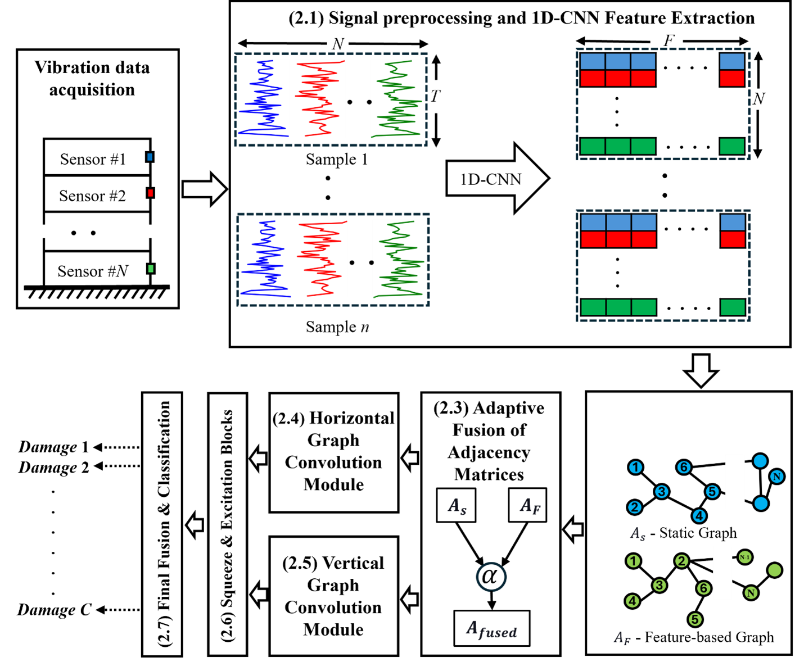

# DualGraphSHM

Official implementation of **"Robust and efficient dual-graph neural networks for structural damage detection and localization"**, published in *Engineering Structures*, Volume 343, 2025, Article 121265.

## Methodology

<p align="center">
  
</p>

The proposed framework consists of five key stages:
1. **Signal Preprocessing & 1D-CNN Feature Extraction** — Raw multi-sensor vibration signals are segmented into windows and passed through a 4-layer 1D-CNN backbone to extract per-sensor feature representations.
2. **Adaptive Fusion of Adjacency Matrices** — A static graph (physical sensor topology) and a feature-based graph (learned via cosine similarity) are fused using Frobenius-norm weighting.
3. **Horizontal Graph Convolution Module (H-GC)** — Multi-scale Chebyshev GCN captures spatial correlations across sensors at multiple neighbourhood hops.
4. **Vertical Graph Convolution Module (V-GC)** — LSTM-gated temporal GCN processes feature segments across time steps with forget-gate connections.
5. **SE Attention Fusion & Classification** — Dual squeeze-and-excitation cross-attention fuses the two branches, followed by a linear classifier for damage state prediction.

## Requirements

```bash
pip install -r requirements.txt
```

Key dependencies: PyTorch, PyTorch Geometric, NumPy, pandas, scikit-learn.

## Data Preparation

Place your dataset CSV files in the `data/` directory. Each CSV should contain:
- First `num_sensors` columns: accelerometer readings
- Last column: class label (integer)
- First row: header (skipped during loading)

**LUMO dataset** (18 sensors, 7 classes): columns `R1, M1, R2, M2, ..., R9, M9, label`

**QUGS dataset** (30 sensors, 5 classes): similar format with 30 sensor columns.

## Usage

### Training

```bash
# LUMO dataset (18 sensors, 7 damage classes)
python train.py --dataset lumo --data_dir data/ --epochs 100 --device cuda:0

# QUGS dataset (30 sensors, 5 classes)
python train.py --dataset qugs --data_dir data/ --epochs 100 --device cuda:0

# Ablation: horizontal branch only
python train.py --dataset lumo --data_dir data/ --mode horizontal

# Ablation: vertical branch only
python train.py --dataset lumo --data_dir data/ --mode vertical
```

### Evaluation

```bash
python evaluate.py --checkpoint best_model.pt --dataset lumo --data_dir data/
```

### Key Arguments

| Argument | Default | Description |
|----------|---------|-------------|
| `--dataset` | `lumo` | Dataset name (`lumo` or `qugs`) |
| `--data_dir` | (required) | Path to CSV data directory |
| `--batch_size` | `64` | Training batch size |
| `--lr` | `0.0001` | Learning rate |
| `--epochs` | `100` | Number of training epochs |
| `--history` | `200` | Window length (time steps per sample) |
| `--mode` | `dual` | Branch mode: `dual`, `horizontal`, `vertical` |
| `--seed` | `42` | Random seed for reproducibility |
| `--device` | `cuda:0` | CUDA device |
| `--save_path` | `best_model.pt` | Checkpoint save path |

## File Structure

| File | Description |
|------|-------------|
| `train.py` | Main training script with argparse |
| `evaluate.py` | Load checkpoint and evaluate on test set |
| `model.py` | `DualGraphSHM` model (main class) |
| `cnn.py` | 1D-CNN backbone |
| `mgcn.py` | Multi-scale GCN (horizontal branch) |
| `lgfm.py` | LSTM-gated temporal GCN (vertical branch) |
| `adaptive_aggregation.py` | Frobenius-norm adaptive adjacency fusion |
| `signal_gcn.py` | GCN wrapper for spatial convolution |
| `layers.py` | `GraphConvolution` layer |
| `se_module.py` | Squeeze-and-Excitation attention |
| `frobenius.py` | Frobenius norm penalty module |
| `graph_utils.py` | Adjacency matrix construction |
| `data_loader.py` | CSV data loading and windowing |

## Citation

```bibtex
@article{dualgraphshm2025,
  title     = {Robust and efficient dual-graph neural networks for structural
               damage detection and localization},
  journal   = {Engineering Structures},
  volume    = {343},
  pages     = {121265},
  year      = {2025},
  doi       = {10.1016/j.engstruct.2025.121265}
}
```

## License

This project is licensed under the [CC BY-NC-ND 4.0](https://creativecommons.org/licenses/by-nc-nd/4.0/) license.
